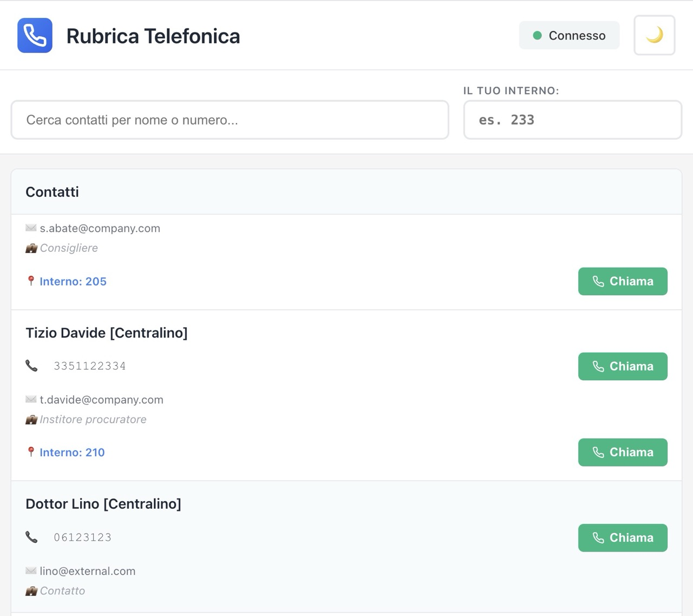
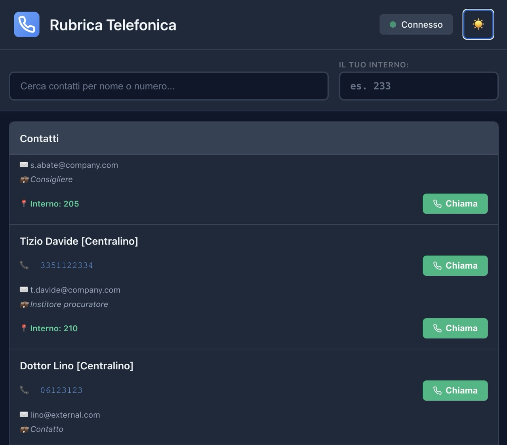
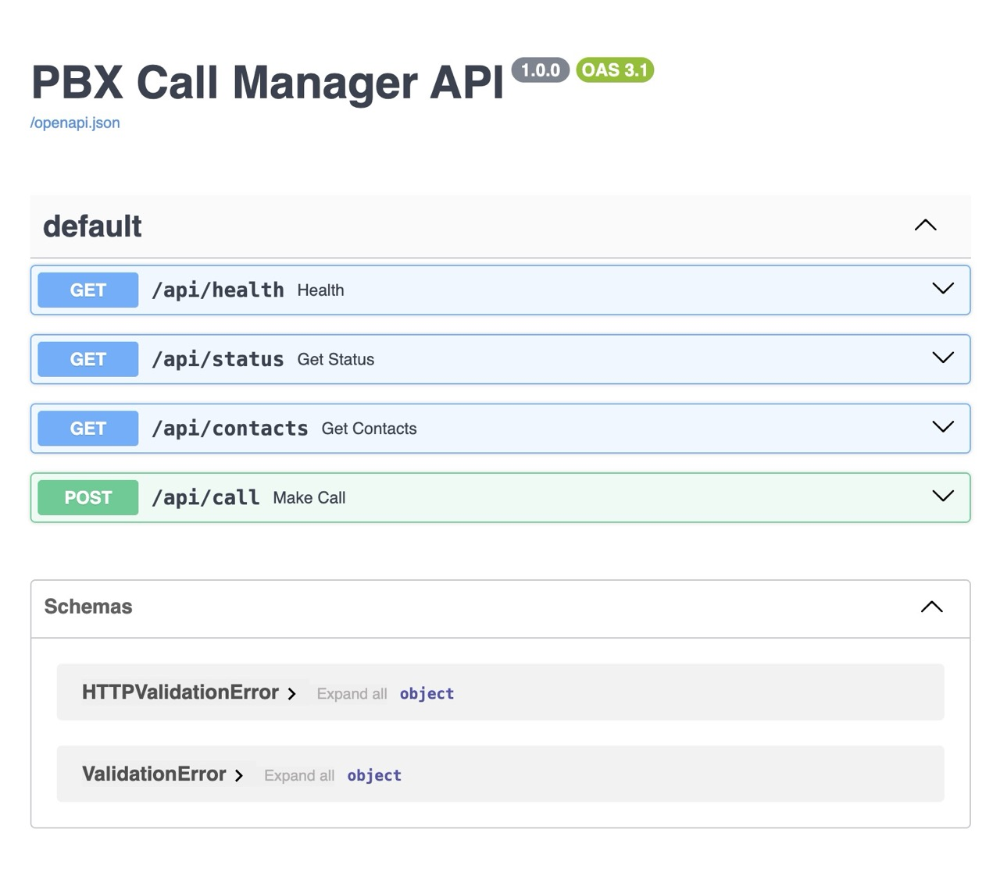

# Phone Directory - PBX Call Manager

A modern web application to manage VoIP calls through FreePBX/Asterisk. It allows you to view contacts, make calls through Asterisk Manager Interface (AMI), and send emails directly from contacts.

## 📚 Documentation

| File | Description |
|------|-------------|
| **[QUICKSTART.md](QUICKSTART.md)** | **START HERE** - Installation and first launch (5 min) |
| [README.md](README.md) | This file - Project overview |
| [CONFIG.md](CONFIG.md) | Complete configuration guide |
| [API.md](API.md) | REST API documentation |
| [DEPLOYMENT.md](DEPLOYMENT.md) | Production deployment guide |

**For new users**: Read [QUICKSTART.md](QUICKSTART.md) first!

## 🎯 Features

- **Modern and responsive interface**: Intuitive UI with light/dark mode support
- **Contact management**: View complete list of contacts with multiple numbers and extensions
- **VoIP calls**: Direct integration with FreePBX via AMI for originate calls
- **Multiple numbers**: Support for mobile, office, and switchboard numbers
- **Clickable emails**: Open your default mail client with a single click
- **Callable extensions**: Directly call other employees' extensions
- **Local persistence**: Automatically save the user's extension in localStorage
- **Customizable theme**: Toggle light/dark mode with persistence







## 🏗️ Architecture

### Backend
- **Framework**: FastAPI with Uvicorn
- **PBX Integration**: pyst2 (Asterisk Manager Interface)
- **Python**: 3.11-slim
- **API Endpoints**:
  - `GET /api/health` - Health check
  - `GET /api/status` - AMI connection status
  - `GET /api/contacts` - Contacts list from numeri.json
  - `POST /api/call` - Originate call to number/extension

### Frontend
- **Framework**: React 18 with Vite
- **Build tool**: Node 18-alpine for build
- **Serving**: Python http.server
- **Dependencies**: lucide-react for icons, axios for API

### Data
- **Format**: JSON (numeri.json)
- **Contact Fields**:
  - `id`: unique identifier
  - `name`: contact name
  - `number`: mobile/main number
  - `office`: office number (optional)
  - `shortInternal`: switchboard extension (optional)
  - `email`: email address
  - `role`: role/title
  - `department`: department

## 🚀 Quick Start

See [QUICKSTART.md](QUICKSTART.md) for detailed installation and deployment instructions.

### Quick Setup (2 minutes)

```bash
# 1. Clone repository
git clone <repo-url> pbxdir && cd pbxdir

# 2. Copy and configure example files
cp backend/.env.example backend/.env
cp numeri.json.example numeri.json

# 3. Edit backend/.env with your FreePBX credentials
nano backend/.env

# 4. Edit numeri.json with your contacts
nano numeri.json

# 5. Start
docker compose up -d --build

# 6. Access
open http://localhost:3000
```

**⚠️ IMPORTANT**: Never commit `backend/.env` and `numeri.json` files (they contain sensitive data)!

## 📋 Detailed Configuration

For complete configuration see [CONFIG.md](CONFIG.md).

### Backend Environment
Create a `.env` file in the `backend/` directory:

```env
PBX_HOST=192.168.1.1
PBX_PORT=5038
PBX_USERNAME=admin
PBX_PASSWORD=manager
```

### Contacts
Edit `backend/numeri.json` to add/modify contacts:

```json
{
  "id": 0,
  "name": "First Name Last Name [Type]",
  "number": "33912345678",
  "office": "021234567",
  "shortInternal": "201",
  "email": "user@company.com",
  "role": "Role",
  "department": "Department"
}
```

## 🔧 Usage

### Making a call
1. Enter your extension in the search bar at the top
2. Select a contact from the list
3. Click "Call" next to the desired number
4. The call will be routed through FreePBX to your extension

### Sending emails
- Click on any email address to open your default mail client

### Changing theme
- Click the sun/moon icon in the top right

## 📦 File Structure

```
pbxdir/
├── backend/
│   ├── main.py              # FastAPI app
│   ├── config.py            # Configuration
│   ├── pbx_manager.py       # AMI management
│   ├── contacts_manager.py  # Contacts management
│   ├── numeri.json          # Contacts database
│   ├── requirements.txt      # Python dependencies
│   └── Dockerfile           # Backend container
├── frontend/
│   ├── src/
│   │   ├── App.jsx          # Main component
│   │   ├── App.css          # App styles
│   │   ├── index.css        # Global styles + dark mode
│   │   ├── main.jsx         # Entry point
│   │   └── components/
│   │       ├── Header.jsx/.css
│   │       ├── SearchBar.jsx/.css
│   │       └── ContactsList.jsx/.css
│   ├── package.json
│   ├── vite.config.js
│   ├── Dockerfile           # Frontend container
│   └── public/index.html
├── docker-compose.yml       # Orchestration
└── README.md               # This file
```

## 🐳 Docker

The application is containerized with docker-compose for easy deployment.

```bash
# Start
docker compose up -d --build

# Stop
docker compose down

# Logs
docker compose logs -f
```

## 🌐 Access

Once running:
- **Frontend**: http://localhost:3000
- **Backend API**: http://localhost:8000
- **API Docs**: http://localhost:8000/docs

## 🔌 FreePBX/Asterisk Requirements

- AMI enabled on port 5038
- AMI user with permissions for `originate`
- External number configured on the system

## 📝 Notes

- User extension is saved in localStorage
- Theme (light/dark) is saved in localStorage
- Emails are clickable mailto:// links
- Supports contacts with multiple numbers (mobile, office, extension)

## 🤝 Support

For issues or questions, check the logs:
```bash
docker compose logs backend  # Backend
docker compose logs frontend # Frontend
```

## 📄 License

Proprietary
